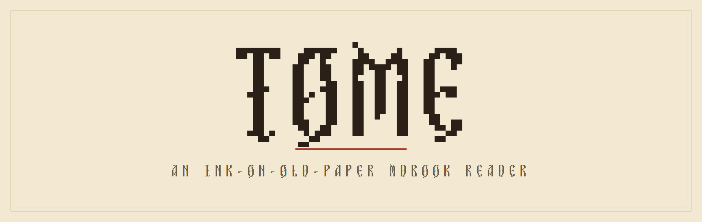
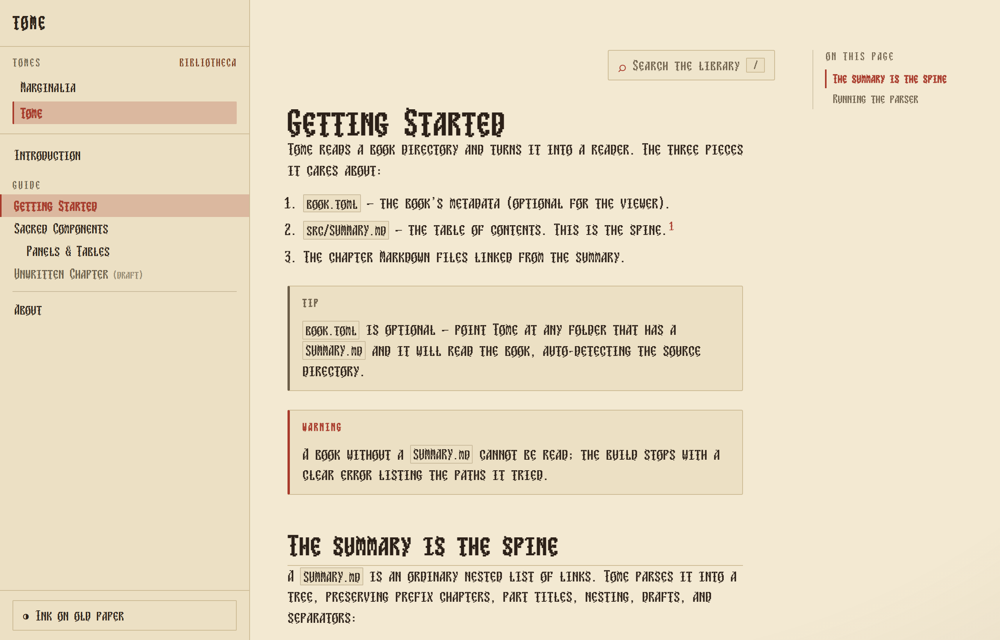
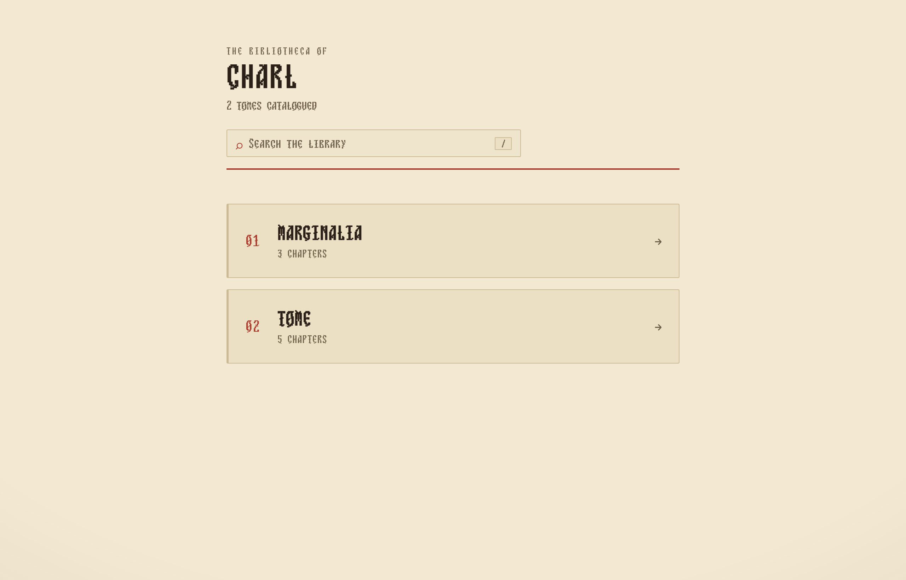
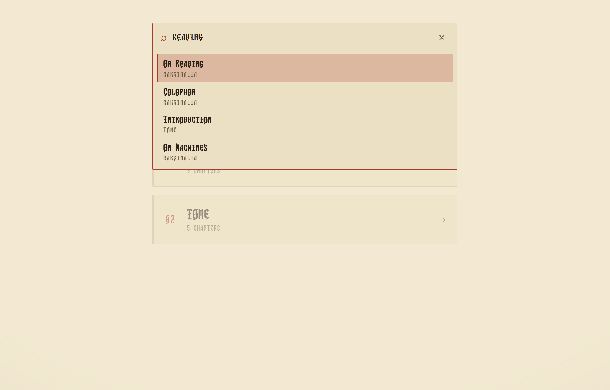
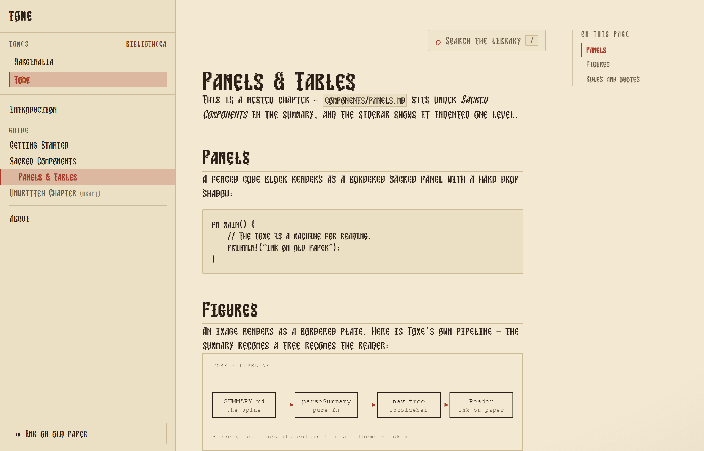
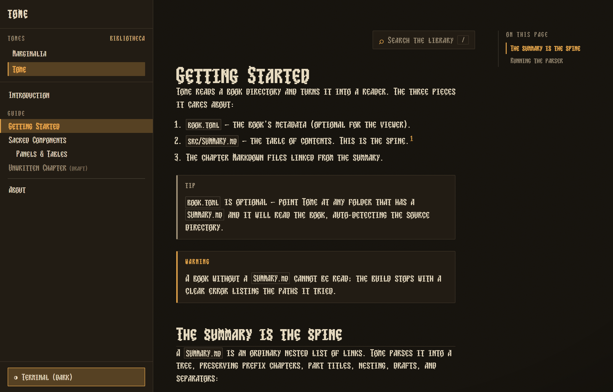
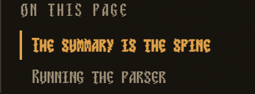

<p align="center">
  
</p>

<p align="center">
  <em>An <a href="https://github.com/rust-lang/mdBook">mdBook</a> reader rendered through the
  <a href="https://github.com/internet-development/www-sacred">sacred computer</a> component
  vocabulary — re-inked onto old paper, set in Mekzantine.</em>
</p>

<p align="center">
  <strong>Astro · SolidJS · TypeScript · Tailwind v4</strong>
  &nbsp;·&nbsp; zero-JS by default
  &nbsp;·&nbsp; library-wide search
  &nbsp;·&nbsp; native offline desktop shell
</p>

---

**Tome** turns any mdBook's source — a `SUMMARY.md` and its chapter Markdown — into a
fast, static reader with an ink-on-old-paper, sacred-terminal aesthetic. It reads one
book or a whole **Bibliotheca** of them, ships almost no JavaScript (a handful of tiny
islands hydrate on idle), and runs as a native, fully-offline desktop app.

<p align="center">
  
</p>
<p align="center"><sub>The reader — a spine parsed from <code>SUMMARY.md</code>, a tome switcher, GitHub-style admonitions, and an “on this page” rail.</sub></p>

## Highlights

<table>
<tr>
<td width="50%" valign="top">
  <br>
  <sub><b>A library, not just a book.</b> Point Tome at several mdBooks and <code>/</code> becomes the Bibliotheca — the library shelf.</sub>
</td>
<td width="50%" valign="top">
  <br>
  <sub><b>Library-wide search.</b> Press <kbd>/</kbd> to rank results across every tome — each hit tagged with its book.</sub>
</td>
</tr>
<tr>
<td width="50%" valign="top">
  <br>
  <sub><b>Rich content, faithfully rendered.</b> Code panels, figures, tables, admonitions, and footnotes — all in the sacred idiom.</sub>
</td>
<td width="50%" valign="top">
  <br>
  <sub><b>Two themes.</b> Ink-on-old-paper by day, a warm amber-phosphor terminal by night.</sub>
</td>
</tr>
</table>

## Quickstart

```bash
npm install
npm run dev        # http://localhost:4321 — the bundled sample library
npm run build      # static site in dist/
npm run electron   # build, then open the native desktop app
```

<details>
<summary>More commands (tests &amp; build gates)</summary>

```bash
npm test                # unit + integration (Vitest)
npm run test:e2e        # end-to-end (Playwright)
npm run check:external  # external single-book build gate
npm run check:multibook # two-tome Bibliotheca build gate
npm run check:search    # search index + query build gate
npm run check:electron  # desktop-shell end-to-end gate (Playwright + Electron)
```
</details>

By default Tome renders a bundled sample **library** of two tomes — *Tome* (this guide)
and *Marginalia* (a short companion). Because there are two, the site opens on the
**Bibliotheca**; pick a tome to read, and use the sidebar switcher to cross between them.

## Read any mdBook

Point `TOME_BOOK` at a book's root (the folder with `book.toml` and a `src/SUMMARY.md`) —
a prebuild step copies it into the reader:

```bash
TOME_BOOK=/path/to/your/mdbook npm run build
# or, live:
TOME_BOOK=/path/to/your/mdbook npm run dev
```

The book's chapters, nesting, prefix/suffix, drafts, and separators all come from
`SUMMARY.md`. When `TOME_BOOK` is unset, the committed sample renders unchanged.

**No `book.toml`? No problem.** It's optional. If it declares `[book].src`, that source
is used; otherwise Tome auto-detects `SUMMARY.md` in `src/`, then `docs/`, then the root:

```bash
TOME_BOOK=/path/to/CubiKan npm run dev   # detects docs/, no book.toml needed
```

The title is taken from `book.toml` (`[book].title`), else the book root's directory name,
else the `SUMMARY.md` heading. If no `SUMMARY.md` is found, the build stops with a clear
error listing the paths it tried.

**Live reload.** During `npm run dev` with `TOME_BOOK` set, Tome watches the book's source
and re-syncs changed files into the reader — edit a chapter on disk and it updates with no
restart. (A dev-only integration; it has no effect on `npm run build`.)

> Note: loading external books overwrites the content library `src/content/books/` at build
> time. Leave `TOME_BOOK`/`TOME_BOOKS` unset for normal development so the sample stays pristine.

## The Bibliotheca — a library of books

Point `TOME_BOOKS` at multiple roots (comma-separated), or list them in `tome.config.toml`:

```bash
TOME_BOOKS=/path/to/rust-book,/path/to/CubiKan npm run build
```

```toml
# tome.config.toml
owner = "Ada"          # masthead reads "The Bibliotheca of Ada" (defaults to your OS user)

[[book]]
path = "../rust-book"

[[book]]
path  = "../CubiKan"
title = "CubiKan"      # optional — overrides the detected title
slug  = "cubikan"      # optional — the URL segment (defaults to the directory name)
```

**Routing is adaptive:**

- **One book** → its chapters sit at the root (`/`, `/getting-started`, …); the book is the whole site.
- **Several books** → each is namespaced under its slug (`/rust-book/…`), `/` becomes the
  **Bibliotheca** (a library index), and the sidebar gains a switcher for jumping between tomes.

Precedence is `TOME_BOOKS`/`TOME_BOOK` (env) → `tome.config.toml` → the bundled sample.
Colliding slugs are de-duplicated (`guide`, `guide-2`). The masthead reads *“The Bibliotheca of
&lt;owner&gt;”*, where `owner` defaults to your OS login name (override with the `owner` key or
`TOME_OWNER`).

## Search

Every page has a **library-wide** search. Press <kbd>/</kbd> (or click the field) to open a
keyboard-first overlay: type to rank results across every tome — titles and headings above
body text — and open one to jump straight to that chapter, deep-linking to the matching heading.

It's built from a static index emitted at build time (`dist/search-index.json`) covering each
chapter's title, headings, and text. The reader fetches it lazily on first open, so a page ships
no search data until you ask — the overlay is the only search JavaScript, hydrated when idle.

## Reading a chapter



Two in-chapter aids appear while reading:

- **On this page** — on wide viewports, a rail lists the chapter's section headings (H2/H3).
  It's server-rendered (the links work with no JavaScript) and, once hydrated, highlights the
  section you're scrolled to.
- **Keyboard navigation** — <kbd>→</kbd>/<kbd>j</kbd> for the next chapter, <kbd>←</kbd>/<kbd>k</kbd>
  for the previous. The shortcuts stand down while you're typing or the search overlay is open.

<br clear="right">

## Content rendering

Beyond standard Markdown, Tome renders:

- **Admonitions / callouts** — GitHub-style alerts. Start a blockquote with `> [!NOTE]` (or
  `TIP`, `IMPORTANT`, `WARNING`, `CAUTION`) and it becomes a titled, sacred-styled panel.
  Rendered at build time by a small remark plugin — no client JS.
- **Footnotes** — GFM footnotes render with a reference → note → back-reference chain, styled as
  a quiet apparatus at the foot of the chapter. (The auto “Footnotes” heading is kept out of the rail.)
- **Print / PDF** — a print stylesheet hides the sidebar, rail, search, and pager, so the
  browser's **Print / Save as PDF** yields a clean ink-on-white chapter.

## Desktop app

Tome ships a native **Electron** shell that renders the built library entirely **offline** — the
Bibliotheca, the reader, search, and in-page navigation all work with no dev server and no network.

```bash
npm run electron        # runs `astro build`, then opens the app
npm run electron:start  # opens the app against an existing dist/ (no rebuild)
```

The window loads `dist/` through a custom `app://tome/` protocol that maps root-absolute URLs
(routes, `/_astro/…`, `/fonts/…`, `/search-index.json`) onto the built output. It's configured
securely — context isolation on, Node integration off, sandbox on — and the protocol serves only
files resolved **inside** `dist/`. Internal links stay in the window; external `http`/`https` links
open in your OS browser.

Zoom can't break the layout: an accidental trackpad pinch / Ctrl-wheel gesture is neutralized
(it would otherwise collapse the reader into the mobile drawer), while deliberate keyboard zoom —
including the native <kbd>Ctrl+0</kbd> reset — still works. The **app icon** is a “T” in the
reader's display font, and it **follows your system theme** (force one with
`TOME_ICON=dark|light|auto`).

> [!NOTE]
> Opening an arbitrary local library from within the app is a planned follow-up.

### Also native — Tauri shell (Windows + Linux)

Electron is the shipping default. Alongside it, a **Tauri v2** shell under `src-tauri/` (Rust + the
OS webview) is a smaller, native alternative that reuses the same `dist/` and runs from **one
codebase on both Windows (WebView2) and Linux (WebKitGTK)** — rendering identically to Chromium.
It reaches Electron parity: the **"Tome" window** with a **theme-aware "T" icon**, the same
**zoom hardening** (an accidental pinch / Ctrl-wheel can't collapse the layout), secure offline
`dist/` loading, and external links routed to your OS browser.

**Windows** — an **8.9 MB `app.exe`** (vs Electron's bundled ~348 MB Chromium):

```bash
npm run tauri:dev     # build the site, then run the native window (needs the Rust toolchain)
npm run tauri:build   # produce a native Windows installer (NSIS + MSI, unsigned)
```

`tauri:build` emits `Tome_0.1.0_x64-setup.exe` (NSIS, ~2 MB) and `Tome_0.1.0_x64_en-US.msi` (~3 MB).

**Linux** — a native **`.deb`** (~4 MB) plus an **AppImage**, built on Linux or WSL2
(Ubuntu 22.04+, webkit2gtk-4.1):

```bash
scripts/build-linux.sh   # see the header for the one-time apt prerequisites
```

Both bundle under `src-tauri/target/release/bundle/`. The ports are verified in `docs/sprints/s18/`
(Windows) and `docs/sprints/s19/` (Linux). Electron remains the default and fallback; `.rpm`
packaging, code-signing, a Linux CI build, and the eventual default-switch are the documented
next steps.

---

<p align="center"><sub>The brand banner and screenshots are generated from the reader's own font and build —
<code>npm run assets:banner</code> · <code>npm run assets:shots</code>.</sub></p>
